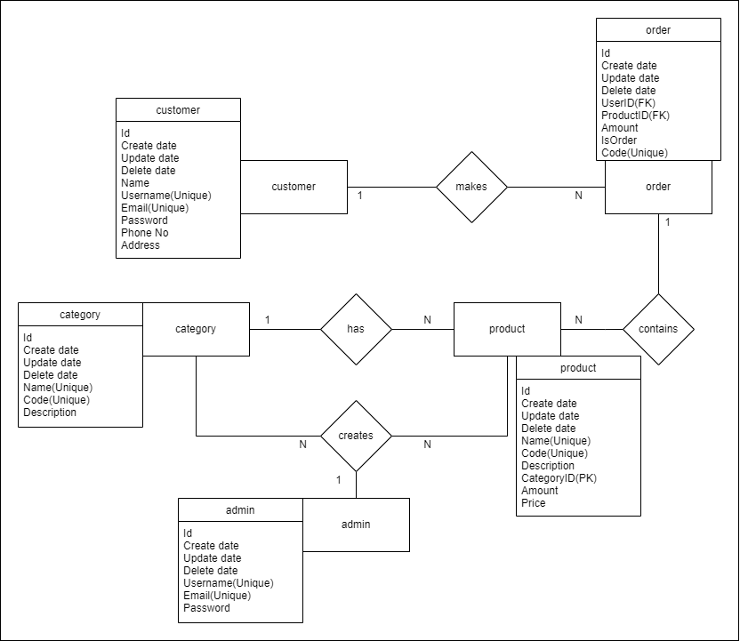

# Go-Bootcamp-Ending-Project

This project is the Golang Backend Web Development bootcamp ending project organized by patika.dev and kodluyoruz, sponsored by Picus Security.
Within the scope of the project, Basket API application was realized.

Used technologies;
- GORM
- Gin
- MySQL 
- JWT
- Swagger

PS: Before you start, set the sql connections in the configs/project.qa.yaml file. If you have your own connections you can do it by setting it on main.go line:18.

#### __Simple Entity Representations__

## API Endpoints

### -Login

In this point requests contain email and password if DB has this user returns JWT token to use other points' Authorization processes.

Point has 2 using with *request body*(email,password); 
``POST localhost:8080/login/customer`` 
``POST localhost:8080/login/admin``

### -Signup

This point takes customer with name,username,email,password,phone and address information but only username,email and password is necessary fields. If there is same name or email customer it will return err. After signup point returns JWT token.

Point has using with *request body*(Customer fields); 
``POST localhost:8080/signup``

### -Category

Getting all categories comes with pagination.
An admin can add a category with uploading csv file, in this file should contains name,code and description columns if there is not one of them api will response with not readable. In adding process if given file line is in DB with same name or code it will not create you can see on logs.

Point has using two router; 
Getting all categories with pagination takes __page__ and __size__ *query parameters*, if you dont enter will be default(1-100). Max size is 10000. 
``GET localhost:8080/category``  

Adding category runs with takes __Authorization JWT token__ and  __form-data__ body __key__ should be named as "__file__", this file taken and uploads in /assets with random name, after this process checks it and adds to DB its lines, if there is some problem with reading deletes the file from /assets if there is not holds the file in /assets . 
``POST localhost:8080/category``

### -Product

Point has five router; 
Get products works like categories, it has same pagination specialities. Pagination takes __page__ and __size__ *query parameters*.  
``GET localhost:8080/product``

Searching has *3 query parameters*. These are "__name__","__categoryId__" or "__amount__". All can work together, name field checks which categories has same query input, categoryId gives back all entered input products that has same categoryId and lastly amount returns back products which has equal or bigger amount products. If there is not entered data returns not found. 
``GET localhost:8080/product/search``

Creating new product needs  __Authorization JWT token__ and request body of Product it should has unique name and code. If category id is not given then categorizing will be default with category named Other.  
``POST localhost:8080/product``

Deleting product runs with  __Authorization JWT token__ and query product id or request body product but this process needs only product id. 
``DELETE localhost:8080/product``

Updating product needs  __Authorization JWT token__ and all product fields especially id,name,categoryid and code. Takes fields and updates them.  
``PUT localhost:8080/product``

### -Basket

Point has five router; 
Get basket works with __Authorization JWT token__ gives back customers all basket items. 
``GET localhost:8080/basket``

Adding basket runs with  __Authorization JWT token__ and request body (product id and amount is needed). There can be one or more product in request and request should not contain same product twice or more. Checks product with given id and is there enough amount of product if there is decreases the products amount. After checking adds them into DB. 
``POST localhost:8080/basket``

Complete to order needs  __Authorization JWT token__. If the basket products deleted by admin. customer should delete the product from own basket. 
``POST localhost:8080/basket/complete``

Deleting basket products runs with  __Authorization JWT token__ and query product id or request body product but this process needs only product id. Deleting process contains delete basket products by one by. 
``DELETE localhost:8080/product``

Updating basket product needs  __Authorization JWT token__ and request body(amount and product id is needed). This process runs on amount count.  
``PATCH localhost:8080/product``

### -Order

There is two router; 
Get orders runs with  __Authorization JWT token__ and returns customers orders. 
``GET localhost:8080/order``

Cancel order works with __Authorization JWT token__ and *query parameter* "__code__". Code represents order and cancels if it has not been 14 days since ordered. 
``PATCH localhost:8080/order/cancel``
